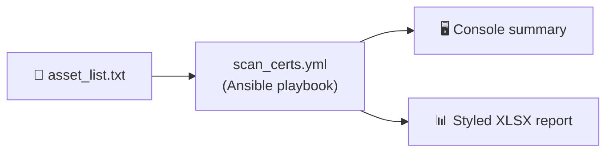

# 🔐 cert-scan

*TLS certificate inventory — IP ranges, host lists, one spreadsheet.*

[Ansible](https://www.ansible.com)
[Platform](https://docs.ansible.com/ansible/latest/installation_guide/index.html)
[TLS](https://en.wikipedia.org/wiki/Transport_Layer_Security)
[Export](#output-and-export)
[GitHub](https://github.com/amrmarey/cert-scan)
[Stars](https://github.com/amrmarey/cert-scan/stargazers)

**Pull cert metadata** (issuer, serial, SANs, days to expiry) **from each target** — **print a summary table** and **write a timestamped XLSX** with color-coded expiry status.

Built for inventories and expiry sweeps — not a substitute for a full PKI audit or pentest.

**[github.com/amrmarey/cert-scan](https://github.com/amrmarey/cert-scan)** · `git clone https://github.com/amrmarey/cert-scan.git`

> **TL;DR** — Put IPs or hostnames in `asset_list.txt` → run `ansible-playbook scan_certs.yml` → get a styled `cert_scan_*.xlsx` plus a console summary.

## Jump to

|     | Section                                       |
| --- | --------------------------------------------- |
| 🎯  | [Overview](#overview)                         |
| 📋  | [Requirements](#requirements)                 |
| 🚀  | [Quick start](#quick-start)                   |
| ✨   | [Features](#features)                         |
| ⚙️  | [Configuration](#configuration)               |
| 📄  | [Input file](#input-file)                     |
| 📤  | [Output and export](#output-and-export)       |
| 🔒  | [Security and caveats](#security-and-caveats) |
| 🤝  | [Contributing](#contributing)                 |
| 📜  | [License](#license)                           |

---

## 🎯 Overview



The playbook runs entirely on `localhost` — no managed nodes needed. Ansible connects directly to each target over TLS using `community.crypto.get_certificate`, then a Python script renders a styled Excel workbook.

| Step | What happens |
| ---- | ------------ |
| **1. Parse** | `asset_list.txt` parsed by a custom filter plugin (supports IPv4, IPv6, FQDNs, per-host port overrides) |
| **2. Scan** | `community.crypto.get_certificate` retrieves the TLS cert from each target |
| **3. Report** | `scripts/generate_report.py` writes a styled XLSX with reverse-DNS lookup and color-coded expiry |

---

## 📋 Requirements

|             |                                                                                          |
| ----------- | ---------------------------------------------------------------------------------------- |
| **Ansible** | 2.14+ (`ansible-core`) — [install guide](https://docs.ansible.com/ansible/latest/installation_guide/) |
| **Python**  | 3.8+ with `openpyxl` (`pip install openpyxl`)                                            |
| **Collection** | `community.crypto >=2.0.0` — installed automatically via `requirements.yml`           |
| **Network** | Reachable targets on the port you choose (firewall / routing)                            |

---

## 🚀 Quick start

### 1. Clone and enter the repo

```bash
git clone https://github.com/amrmarey/cert-scan.git
cd cert-scan
```

### 2. Install the Ansible collection

```bash
ansible-galaxy collection install -r requirements.yml -p ./collections
```

### 3. Install the Python dependency

```bash
pip install openpyxl
```

### 4. Edit your target list

```bash
cp asset_list.txt.example asset_list.txt
# edit asset_list.txt with your IPs / hostnames
```

### 5. Run the scan

```bash
ansible-playbook scan_certs.yml
```

The XLSX report is written to `output/cert_scan_<timestamp>.xlsx`.

**Override variables on the command line:**

```bash
ansible-playbook scan_certs.yml \
  -e asset_list_file=/path/to/my_list.txt \
  -e default_port=8443 \
  -e connect_timeout=5
```

---

## ✨ Features

|     | Capability                                                                  | ✓   |
| --- | --------------------------------------------------------------------------- | --- |
| 🎯  | **Targets** — IPv4, IPv6 (bracket notation), DNS names, per-host port override | ✅  |
| 🔌  | `default_port` var — default `443`, any TCP port                            | ✅  |
| 🏷️  | **Reverse DNS** — PTR hostname resolved for every IP address                | ✅  |
| 🔑  | **Serial** — decimal *and* hex in separate columns                          | ✅  |
| 📋  | **SANs** — all Subject Alternative Names captured                           | ✅  |
| 🎨  | **Styled XLSX** — color-coded expiry, frozen header row, auto-filter        | ✅  |
| 🛡️  | Failures become rows with `N/A` values and an `Error` column                | ✅  |
| 📁  | Output dir created automatically; report path is timestamped                | ✅  |

---

## ⚙️ Configuration

Playbook variables (set in `scan_certs.yml` `vars:` block or via `-e`):

| Variable           | Default                                    | Description                             |
| ------------------ | ------------------------------------------ | --------------------------------------- |
| `asset_list_file`  | `{{ playbook_dir }}/asset_list.txt`        | Path to target list                     |
| `default_port`     | `443`                                      | TCP port used when not specified inline |
| `connect_timeout`  | `3`                                        | TLS connect timeout in seconds          |
| `output_dir`       | `{{ playbook_dir }}/output`                | Directory for XLSX output               |
| `report_path`      | `{{ output_dir }}/cert_scan_<ts>.xlsx`     | Full path of the generated report       |

Ansible behavior is controlled by `ansible.cfg`:

```ini
[defaults]
collections_path    = ./collections
host_key_checking   = False
stdout_callback     = yaml
retry_files_enabled = False
```

---

## 📄 Input file

`asset_list.txt` (or any path you pass via `asset_list_file`):

| Rule      |                                                                       |
| --------- | --------------------------------------------------------------------- |
| Lines     | **One** IP or hostname per line                                        |
| Blank     | Ignored                                                               |
| `#`       | Comment to end of line                                                |
| Port      | Optional: append `:port` to override default (e.g., `1.2.3.4:8000`) |
| IPv6      | Use bracket notation: `[2001:db8::1]` or `[2001:db8::1]:8443`        |

```text
# Example
192.168.1.10
192.168.1.11:8443
www.example.com
[2001:db8::80]:9443
```

**Port behavior:**

- No port specified → uses `default_port` variable (default `443`)
- Port specified inline (e.g., `1.2.3.4:8000`) → overrides the variable for that target only

---

## 📤 Output and export

| Channel     | What you get                                                                                                   |
| ----------- | -------------------------------------------------------------------------------------------------------------- |
| **Console** | Summary table: `Asset`, `Hostname`, `Port`, `Status`, `Days`, `Expiry`                                        |
| **XLSX**    | Styled Excel workbook — frozen header, auto-filter, color-coded `Expiry_Status` column, all columns below     |

**Output columns:**

| Column              | Description                                                                 |
| ------------------- | --------------------------------------------------------------------------- |
| `Asset_IP_Add`      | IP or hostname from the input list                                          |
| `Hostname`          | Reverse-DNS PTR name (IPs only; empty for hostnames)                        |
| `Port`              | TCP port used                                                               |
| `HTTPS`             | `Yes` if certificate retrieved, `No` if connection failed                   |
| `Cert_Issuer`       | Issuer DN from the certificate                                              |
| `Serial_Number`     | Certificate serial in decimal                                               |
| `Serial_Hex`        | Certificate serial in hex (`0x…`)                                           |
| `Subject_Alt_Names` | All SANs, semicolon-separated                                               |
| `Days_Remaining`    | Days until `NotAfter`                                                       |
| `Expiry_Date`       | Certificate expiry timestamp (UTC)                                          |
| `Expiry_Status`     | **Healthy** (≥90 days) · **Warning** (30–89) · **Critical** (<30) · **Expired** |
| `Error`             | Connection or TLS error message (empty on success)                          |

**Expiry color coding:**

| Status       | Cell color  |
| ------------ | ----------- |
| 🟢 Healthy   | Green       |
| 🟡 Warning   | Yellow      |
| 🟠 Critical  | Orange      |
| 🔴 Expired   | Red         |
| ⚫ N/A       | Grey        |

---

## 🔒 Security and caveats

> [!WARNING]
> `community.crypto.get_certificate` accepts any server certificate by default. Run only against **systems and networks you own or are explicitly authorized to test.**

| Topic             | Notes                                                                              |
| ----------------- | ---------------------------------------------------------------------------------- |
| ⏱️ **Runtime**    | Large lists multiply `connect_timeout` — plan wall-clock time accordingly          |
| 🔀 **Inspection** | Corporate proxies may replace certs; issuer may reflect the proxy, not the origin  |
| 🌐 **SNI**        | Hostnames are used for TLS SNI — matches typical browser behavior                  |
| 🔍 **Reverse DNS**| PTR lookups use a 2-second timeout per IP; unreachable DNS servers slow the report |

---

## 🤝 Contributing

**Maintainer:** Amr Marey · **[amr.marey@msn.com](mailto:amr.marey@msn.com)**

|            |                                                                            |
| ---------- | -------------------------------------------------------------------------- |
| **Repo**   | **[github.com/amrmarey/cert-scan](https://github.com/amrmarey/cert-scan)** |
| **Issues** | **[Open an issue](https://github.com/amrmarey/cert-scan/issues)**          |
| **Clone**  | `git clone https://github.com/amrmarey/cert-scan.git`                      |

Pull requests are welcome — especially docs, edge cases, and safer defaults.

---

## 📜 License

Use and adapt for your organization **as needed**. **No warranty** implied.

> **Note:** This project was shaped with AI assistance, but the vision, direction, and polish are entirely based on vibes — my vibes.

---

### *Scan the fleet. Ship the spreadsheet.*

**Made for operators who want answers in a spreadsheet — fast.**

Not another pane to babysit — an **XLSX you can filter, pivot, and attach to a ticket.**

| 🔐                | 📊                      | ⚡                                 |
| ----------------- | ----------------------- | ---------------------------------- |
| **TLS** inventory | **XLSX** out of the box | **One** playbook, no custom agents |

`**[amrmarey/cert-scan](https://github.com/amrmarey/cert-scan)**`

Clone · aim at targets · export · done.
