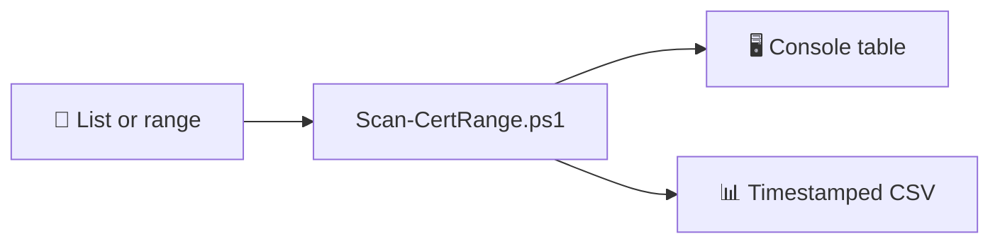

# 🔐 cert-scan

### *TLS certificate inventory — IP ranges, host lists, one CSV.*

[PowerShell](https://github.com/PowerShell/PowerShell)
[Platform](https://www.microsoft.com/windows)
[TLS](https://en.wikipedia.org/wiki/Transport_Layer_Security)
[Export](#output-and-export)
[GitHub](https://github.com/amrmarey/cert-scan)
[Stars](https://github.com/amrmarey/cert-scan/stargazers)

**Pull cert metadata** (issuer, serial, days to expiry) **from each target** — **print a table** and **write a timestamped CSV** next to the script.

Built for inventories and expiry sweeps — not a substitute for a full PKI audit or pentest.

**[github.com/amrmarey/cert-scan](https://github.com/amrmarey/cert-scan)** · `git clone https://github.com/amrmarey/cert-scan.git`

> **TL;DR** — Put IPs or hostnames in a text file → run `**Scan-CertRange.ps1`** → get `**cert-scan-*.csv*`* plus a console summary.

## Jump to


|     | Section                                       |
| --- | --------------------------------------------- |
| 🎯  | [Overview](#overview)                         |
| 📋  | [Requirements](#requirements)                 |
| 🚀  | [Quick start](#quick-start)                   |
| ✨   | [Features](#features)                         |
| 🧰  | [CLI reference](#cli-reference)               |
| 📄  | [Input file](#input-file)                     |
| 📤  | [Output and export](#output-and-export)       |
| 🔒  | [Security and caveats](#security-and-caveats) |
| 🤝  | [Contributing](#contributing)                 |
| 📜  | [License](#license)                           |


---

## 🎯 Overview




The script runs in **file mode** only:

| Mode         | Input                                                                                  |
| ------------ | -------------------------------------------------------------------------------------- |
| **📂 File**  | **IPs** (IPv4 & IPv6), **FQDNs** — one per line in `asset_list.txt` (or any path you pass) |


---

## 📋 Requirements


|         |                                                                                     |
| ------- | ----------------------------------------------------------------------------------- |
| Shell   | **Windows PowerShell 5.1** or **PowerShell 7+** (`pwsh`)                            |
| Network | Reachable targets on the `**-Port`** you choose (firewall / routing)                |
| Policy  | If scripts are blocked, use the **bypass** one-liner in [Quick start](#quick-start) |


---

## 🚀 Quick start

```powershell
cd <path-to>\cert-scan
```

**📂 File mode** *(IPs, IPv6, FQDNs)*

Edit `**asset_list.txt`**, then:

```powershell
.\Scan-CertRange.ps1 -IPListFile .\asset_list.txt
```

**🔓 Execution policy blocked?**

```powershell
powershell -NoProfile -ExecutionPolicy Bypass -File .\Scan-CertRange.ps1 -IPListFile .\asset_list.txt
```

On **PowerShell 7**, you can swap `powershell` for `pwsh`.

---

## ✨ Features


|     | Capability                                                       | ✓   |
| --- | ---------------------------------------------------------------- | --- |
| 🎯  | **Targets** — IPv4, IPv6, bracketed IPv6, DNS names from a list  | ✅   |
| 🔌  | `**-Port`** — default `**443`**, any TCP port                    | ✅   |
| 📊  | **Auto CSV** — `cert-scan-yyyyMMdd-HHmmss.csv` beside the script | ✅   |
| 🧾  | `**-CsvPath`** — choose your own output path                     | ✅   |
| 🛡️ | Failures become rows with `**N/A`** and an `**Error**` column    | ✅   |


---

## 🧰 CLI reference


| Switch            | Required | Default  | What it does                                 |
| ----------------- | -------- | -------- | -------------------------------------------- |
| `**-IPListFile**` | Yes      | —        | Path to target list (required)               |
| `**-Port**`       | No       | `443`    | TCP port                                     |
| `**-Timeout**`    | No       | `3000`   | Connect wait (**milliseconds**)              |
| `**-CsvPath`**    | No       | *(auto)* | Explicit CSV path; omit for timestamped file |

---

## 📄 Input file

`**asset_list.txt`** (or any path you pass to `**-IPListFile**`):


| Rule      |                                                                           |
| --------- | ------------------------------------------------------------------------- |
| Lines     | **One** IP or hostname per line                                           |
| Blank     | Ignored                                                                   |
| `#`       | Comment to end of line                                                    |
| Port      | Optional: append `:port` to override default (e.g., `1.2.3.4:8000`)      |
| Bad lines | **Warning** in console, line skipped                                      |


```text
# Example
192.168.1.10
192.168.1.11:8443
www.example.com
[2001:db8::80]:9443
```

**Port behavior:**

- No port specified → uses `-Port` parameter (default `443`)
- Port specified in line (e.g., `1.2.3.4:8000`) → overrides the parameter for that target

---

## 📤 Output and export


| Channel     | What you get                                                                                                                                                                                     |
| ----------- | ------------------------------------------------------------------------------------------------------------------------------------------------------------------------------------------------ |
| **Console** | Columns: `Asset_IP_Add`, `Port`, `HTTPS`, `Cert_Issuer`, `Serial_Number`, `Days_Remaining`, `Expiry_Status`, `Error`                                                                            |
| **CSV**     | UTF-8, no type row (`Export-Csv -NoTypeInformation`); includes all columns. `**Serial_Number`** is written as `**="…"`** so **Excel** shows full decimals (not scientific notation).                |


**Custom path:**

```powershell
.\Scan-CertRange.ps1 -IPListFile .\asset_list.txt -CsvPath .\reports\last-scan.csv
```

---

## 🔒 Security and caveats

> [!WARNING]  
> The script **accepts any server certificate** (custom validation callback). Run only against **systems and networks you own or are explicitly authorized to test.**


| Topic             | Notes                                                                             |
| ----------------- | --------------------------------------------------------------------------------- |
| ⏱️ **Runtime**    | Large ranges multiply `**Timeout`** — plan wall-clock time                        |
| 🔀 **Inspection** | Corporate AV / proxies may replace certs; issuer may be **local**, not the origin |
| 🌐 **SNI**        | Hostnames in the list are used for **TLS SNI** — matches typical browser behavior |


---

## 🤝 Contributing

**Maintainer:** Amr Marey · **[amr.marey@msn.com](mailto:amr.marey@msn.com)**


|            |                                                                            |
| ---------- | -------------------------------------------------------------------------- |
| **Repo**   | **[github.com/amrmarey/cert-scan](https://github.com/amrmarey/cert-scan)** |
| **Issues** | **[Open an issue](https://github.com/amrmarey/cert-scan/issues)**          |
| **Clone**  | `git clone https://github.com/amrmarey/cert-scan.git`                      |


Pull requests are welcome — especially docs, edge cases, and safer defaults (without breaking simple “inventory mode”).

**Output columns** created for each target:

- **Asset_IP_Add** — hostname or IP from the list
- **Port** — TCP port used (default 443)
- **HTTPS** — "Yes" if certificate retrieved, "No" if connection failed
- **Cert_Issuer** — issuer DN from the certificate (or N/A on error)
- **Serial_Number** — certificate serial in decimal format (Excel-safe)
- **Days_Remaining** — days until `NotAfter` date (or N/A on error)
- **Expiry_Date** — certificate expiry timestamp
- **Expiry_Status** — **Healthy** (>90 days), **Warning** (30–89 days), **Critical** (<30 days), or **Expired**
- **Error** — connection or TLS error message (empty on success)

---

## 📜 License

Use and adapt for your organization **as needed**. **No warranty** implied.

> **Note:** This project was shaped with AI assistance, but the vision, direction, and polish are entirely based on vibes — my vibes.

---

### *Scan the fleet. Ship the spreadsheet.*

**Made for operators who want answers in a spreadsheet — fast.**

Not another pane to babysit — a **CSV you can filter, pivot, and attach to a ticket.**


| 🔐                | 📊                     | ⚡                            |
| ----------------- | ---------------------- | ---------------------------- |
| **TLS** inventory | **CSV** out of the box | **One** `.ps1`, no installer |


`**[amrmarey/cert-scan](https://github.com/amrmarey/cert-scan)`**

Clone · aim at targets · export · done.
